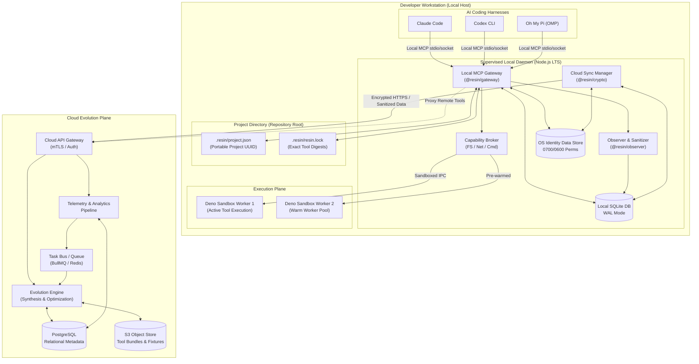

# Resin Architecture Overview

## Executive Summary

**Resin** is an autonomous, privacy-preserving infrastructure system that observes AI coding agent workflows, detects performance bottlenecks and repetitive tool patterns, and autonomously synthesizes, verifies, sandboxes, and deploys optimized Model Context Protocol (MCP) tools directly to developer workstations.

The architecture is divided into two primary tiers:
1. **Local Workstation Tier**: A lightweight, user-level background daemon providing a unified Local MCP Gateway, real-time Observer, sandboxed Deno execution workers, embedded SQLite storage, and a pre-authorized Capability Envelope.
2. **Cloud Evolution Tier**: A scalable backend providing multi-tenant tool registry cataloging, asynchronous synthesis pipelines, test generation, and anonymized collective telemetry aggregation. Cloud never executes tools against developer repositories.

## System Topology & Architecture Diagram

## Project Runtime & Metadata Model

Resin implements a deterministic, zero-prompt bootstrap and exact tool-sync contract across projects:

### 1. Root Resolution and Automatic Bootstrap
When starting MCP or resolving tools, Resin automatically identifies the project root:
- **Git Root Resolution**: If running within a Git repository, the root is the top-level Git working tree.
- **Non-Git Fallback**: If not within a Git repository, the root is the MCP startup directory.
- **Synchronous Zero-Prompt Bootstrap**: If `.resin/project.json` or `.resin/resin.lock` is missing, Resin automatically creates them synchronously during resolver initialization. No user prompts, confirmations, or interactive setup are required.

### 2. Committed Portable Files vs. Local Trust
- **`.resin/project.json`**: Contains portable project metadata (`schemaVersion: 1`, project UUID `id`, `name`, and timestamp). It declares identity, not execution authority.
- **`.resin/resin.lock`**: Contains locked tool versions and SHA-256 content digests. It ensures exact byte-for-byte reproducibility across checkouts.
- **Non-Authorizing Invariant**: Committed files in `.resin/` **cannot authorize execution**. Local execution is authorized solely by the user's local trust store.
- **OS-Standard Identity Partitioning**: Authorization certificates, tokens, and trust stores reside outside the project tree in OS-standard data directories (e.g. `XDG_DATA_HOME` / `~/.local/share` on Linux, `~/Library/Application Support` on macOS, `%LOCALAPPDATA%` on Windows) partitioned strictly by `<account_id>/<user_id>/<project_id>` with POSIX `0700`/`0600` permissions.

### 3. Move, Rename, Fork, and Template Lifecycles
- **Same-Account Move / Rename**: Moving or renaming a directory retains the project UUID in `.resin/project.json`. Local daemon and Cloud recognize the UUID idempotently.
- **Cross-Account Clones / Public Forks / Template Repositories**: When a project is cloned by a different user/organization, the project UUID is recognized as owned by another identity. Cloud returns a non-enumerating `fork_required` response (preserving project privacy without leaking owner details). This triggers an explicit fork/import outcome where a newly initialized project identity and UUID are established under the caller's account, preventing cross-account authorization hijacking.
- **Offline Bootstrap & Later Registration**: An offline project operates immediately with `outcome: "local_only"`. When online connectivity and an authenticated session are established, the project registers idempotently with Cloud without modifying locked tool definitions.

### 4. Deletion, Invalidation, and Recovery
- **Deleting `.resin/project.json`**: Resets and breaks the stable project identity and its link to local trust records unless explicitly recovered from Cloud or git history; it is not a routine safe repair operation.
- **Deleting `.resin/resin.lock`**: Destroys the exact locked tool selections and cryptographic digests; execution cannot proceed with silent empty locks or substituted versions and requires explicit lock recovery or re-qualification.
- **Deleting Local Trust State or Cache**: Disables offline execution and invalidates local authorization, requiring online re-authentication, fresh signature verification, and re-downloading authorized tool packages.
- **Data Residency & Execution Invariant**: Raw session transcripts and original private source remain local. Sanitized evidence may include engine-redacted recorded-program source views; cloud never executes tools against developer repositories.

## Core Local Components

### 1. Local MCP Gateway (`@resin/gateway`)
The Local MCP Gateway is the single point of contact for all AI coding harnesses on the developer's machine ([ADR 0001](../adr/0001-v1-topology.md)). It:
- Exposes standard Model Context Protocol (MCP) endpoints via stdio, Unix domain sockets, and localhost HTTP/SSE.
- Dynamically routes tool invocations to local sandboxed workers or proxies to cloud-hosted tools.
- Maintains in-memory routing tables for instant, sub-100ms canaries and rollbacks.
- Adds less than 2ms ($p50$) routing latency overhead ([ADR 0009](../adr/0009-nfr-and-performance-targets.md)).

### 2. Observer & Sanitizer (`@resin/observer`)
The Observer passively monitors tool executions, transcript interactions, and performance metrics:
- Records raw execution traces into local SQLite ([ADR 0005](../adr/0005-privacy-data-boundaries.md)). Raw session transcripts remain strictly local.
- Runs a multi-stage local redaction pipeline to scrub credentials, private paths, and PII.
- Generates sanitized observation summaries for the evolution engine.
- Continuously tracks each session's workflow episodes locally, running the deterministic opportunity engine over metadata-projected events to attest recurring patterns. Proven patterns are queued in a local outbox, deduplicated by structural hash, and dispatched only when projected savings exceed the configured synthesis cost; the evolution kill switch halts detection.
- Exposes `@resin/observer/recording` for parser-free reconstruction from frozen workflow carriers. `recordCarriedCallsFromEvents` retains bounded, dependency-closed candidates alongside the original recording, preserving programs, private references, and binding proposals. Missing carriers are reported as skipped, unknown reference scopes remain unresolved, and proposed bindings are not executable facts.
- Ordinary non-program JSON data leaves may produce typed, unconfirmed input proposals without exposing values or defaults. Caller-declared composed inputs are named by logical execution position, argument, and nested path, so two callsites may use different values for an argument named `echo` while a repeated execution retains the same input identity. Prior-result proposals take precedence at the same position. Independent recorded variations must distinguish the proposed binding from its original value before it becomes an executable input or result edge.
- Output evidence shares only JSON type and meaningful-content presence. It can request replay, but cannot attest correctness or replace a missing recorded result.
- Recorded JavaScript, TypeScript, and Python program templates may expose a redacted literal source view with paired `sourceReference` and `protectedTokens`. Canonical token alignment must survive redaction; changed tokens cannot become parameter holes. Shell, unparseable, truncated, or untrusted projections remain opaque. Replay and identity require the locally resolved original, never the public view as fallback.
- The local shell tokenizer can propose static data arguments inside complete ordinary command substitutions without changing recorded token positions. Executable positions, arithmetic substitutions, dynamic or compound words, and unsupported or incomplete substitution forms stay opaque; confirmed values use the original token's quoting and span. If compound grammar prevents reliable delimiter recovery, the remaining suffix stays opaque.
- Binding proposals referring outside the selected execution are not retained as parameterization candidates. They do not mark recorded calls as skipped: the original argument remains unchanged. Missing recorded dependencies, unlike optional proposals, still make the capture incomplete.
- Python cells with session dependencies carry a bounded, ordered closure of successful setup cells from the same kernel. Source and required inputs remain private local references, not serialized globals. Unresolved reads, failed or reset state, and unsupported mutation fail closed; verified setup runs once before its target in a fresh Python process.
- Native OMP observations preserve the authoritative full output, recovering bounded local artifacts when the transcript display is truncated. An unavailable full output cannot become a replay baseline. Interface-specific whitespace comparison is recorded explicitly and does not change runtime stdout.
- Every recorded program or meaningful observed step output requires complete replay of the exact final plan, even without binding proposals. Original caller arguments and independently observed held-out arguments stay behind distinct owner-scoped references; only actual captured values at declared argument positions, including input leaves nested inside object and array templates, can supply replay inputs. Missing, incompatible, conflicting, or unresolved values never become defaults. Process-only plans attest fresh-process replay; mixed plans attest host replay and identify their fresh-process steps. Neither label establishes filesystem or remote-service isolation. The original baseline proves only the closed plan, not an independent held-out example or a proposed binding.

### 3. Capability Broker (`@resin/runtime`)
The Capability Broker enforces the pre-authorized **Capability Envelope** ([ADR 0007](../adr/0007-capability-envelope-and-security.md)):
- Mediates all filesystem, network, and subprocess access from tool workers.
- Restricts filesystem access to authorized workspace roots and prevents access to sensitive files (`.git`, `.env`).
- Restricts network calls to whitelisted domains and blocks unauthorized shell spawns.
- After a complete workflow replay verifies, reports hash-only identities for its parameterized programs. Each identity binds the exact applied template and hashes workspace-scoped source with only executable parameter holes substituted; non-parameter code remains significant. Private source is resolved locally and never included in the decision. Missing identities establish no equivalence.
- Recorded inputs may declare type-matching defaults. Defaults make those schema properties optional and apply only when the input is absent; supplied `0`, `false`, and empty strings remain intact. Unknown inputs and type mismatches, including invalid explicit `null`, fail before execution.

### 4. Deno Execution Sandbox (`@resin/runtime`)
Executes tool code in hermetically isolated, pinned Deno worker subprocesses ([ADR 0002](../adr/0002-daemon-and-worker-isolation.md)):
- Enforces hard memory limits (30MB per worker) and execution timeouts (30s).
- Isolates faults so a crashing or hung tool never terminates the gateway.
- Leverages a pre-warmed worker pool for sub-5ms warm invocation execution.

### 5. Local Storage & Trust (`@resin/db` & `@resin/crypto`)
Embedded SQLite with Write-Ahead Logging (WAL mode) and OS-standard identity-partitioned trust stores ([ADR 0006](../adr/0006-storage-and-runtimes.md)):
- Manages workspace scopes, tool registry metadata, candidate lifecycle states, cryptographic audit logs, and runtime activation certificates.

## Core Cloud Components

### 1. Cloud API Gateway & Ingestion
- Authenticates local daemon sync sessions via mTLS or bearer tokens.
- Ingests sanitized observation batches and enqueues them for pattern analysis.

### 2. Evolution Engine & Task Queue
- Asynchronously processes aggregated telemetry to detect optimization opportunities (e.g., repetitive tool chains, slow query patterns).
- Synthesizes candidate MCP tools and workflows using specialized code models.
- Generates property-based contract test suites and publishes immutable tool bundles to S3.

### 3. Cloud Storage & Catalog
- **Amazon DynamoDB**: Single-table datastore with continuous PITR for relational metadata, multi-tenant accounts, global catalogs, and outbox streams.
- **Amazon S3**: Immutable, versioned object storage for cryptographically signed tool bundles and verification fixtures.

## Key Architectural Principles

1. **Local-First & Offline-Capable**: All local tools execute and function with 100% reliability even when completely disconnected from the internet.
2. **Zero-Prompt Autonomy within Envelope**: Tools bootstrap, lock, qualify, and execute autonomously without prompting the developer, provided they stay within the pre-authorized security envelope.
3. **Strict Data Residency**: Raw session transcripts, unredacted conversation turns, original private program source, and private store values remain local. Sanitized observation DTOs may carry engine-redacted program views with non-secret code and literals. Cloud never executes tools against developer repositories.
4. **Hermetic & Deterministic**: Pinned runtime binaries, exact version/digest locks, and comprehensive contract tests ensure identical behavior across Linux, macOS, and WSL2 ([ADR 0003](../adr/0003-supported-harnesses-and-platforms.md)).

## Architecture References
- [System Boundaries and Process Model](boundaries.md)
- [Canonical Architectural Glossary](glossary.md)
- [Non-Functional Requirements (NFR) Matrix](nfr.md)
- [ADR 0001: V1 Topology](../adr/0001-v1-topology.md)
- [ADR 0002: Daemon Architecture & Sandboxing](../adr/0002-daemon-and-worker-isolation.md)
- [ADR 0003: Supported Harnesses & Platforms](../adr/0003-supported-harnesses-and-platforms.md)
- [ADR 0005: Privacy & Data Residency](../adr/0005-privacy-data-boundaries.md)
- [ADR 0006: Storage Systems and Runtime Technology Stack](../adr/0006-storage-and-runtimes.md)
- [ADR 0007: Capability Envelope & Security](../adr/0007-capability-envelope-and-security.md)
- [ADR 0009: Non-Functional Requirements](../adr/0009-nfr-and-performance-targets.md)
- [ADR 0010: ADR Governance](../adr/0010-adr-governance.md)
