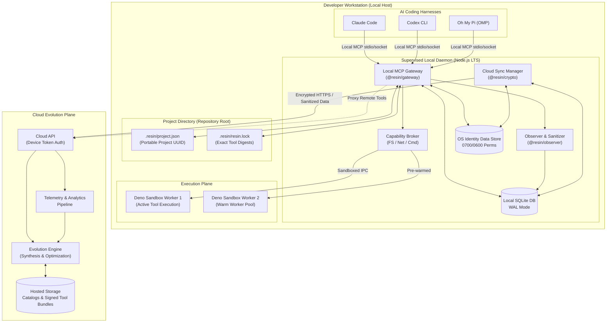

# Resin Architecture Overview

## Executive Summary

**Resin** is an autonomous, privacy-preserving infrastructure system that observes AI coding agent workflows, detects performance bottlenecks and repetitive tool patterns, and autonomously synthesizes, verifies, sandboxes, and deploys optimized Model Context Protocol (MCP) tools directly to developer workstations.

The architecture is divided into two primary tiers:
1. **Local Workstation Tier**: A lightweight, user-level background daemon providing a unified Local MCP Gateway, real-time Observer, sandboxed Deno execution workers, embedded SQLite storage, and a pre-authorized Capability Envelope.
2. **Cloud Evolution Tier**: A scalable backend providing multi-tenant tool registry cataloging, asynchronous synthesis pipelines, test generation, and anonymized collective telemetry aggregation. Cloud never executes tools against developer repositories.

## System Topology & Architecture Diagram

```mermaid
flowchart TB
    subgraph LocalStation["Developer Workstation (Local Host)"]
        subgraph Harnesses["AI Coding Harnesses"]
            ClaudeCode["Claude Code"]
            CodexCLI["Codex CLI"]
            OMP["Oh My Pi (OMP)"]
        end

        subgraph LocalDaemon["Supervised Local Daemon (Node.js LTS)"]
            LocalGateway["Local MCP Gateway\n(@resin/gateway)"]
            Observer["Observer & Sanitizer\n(@resin/observer)"]
            CapBroker["Capability Broker\n(FS / Net / Cmd)"]
            SyncMgr["Cloud Sync Manager\n(@resin/crypto)"]
            LocalDB[("Local SQLite DB\nWAL Mode")]
            TrustStore[("OS Identity Data Store\n0700/0600 Perms")]
        end

        subgraph ProjectDir["Project Directory (Repository Root)"]
            ProjectMeta[".resin/project.json\n(Portable Project UUID)"]
            ProjectLock[".resin/resin.lock\n(Exact Tool Digests)"]
        end

        subgraph Sandbox["Execution Plane"]
            DenoWorker1["Deno Sandbox Worker 1\n(Active Tool Execution)"]
            DenoWorker2["Deno Sandbox Worker 2\n(Warm Worker Pool)"]
        end
    end

    subgraph CloudPlane["Cloud Evolution Plane"]
        CloudAPI["Cloud API\n(Device Token Auth)"]
        TelemetryIngest["Telemetry & Analytics\nPipeline"]
        EvolEngine["Evolution Engine\n(Synthesis & Optimization)"]
        CloudStore[("Hosted Storage\nCatalogs & Signed Tool Bundles")]
    end

    %% Local Connections
    ClaudeCode -->|Local MCP stdio/socket| LocalGateway
    CodexCLI -->|Local MCP stdio/socket| LocalGateway
    OMP -->|Local MCP stdio/socket| LocalGateway

    LocalGateway --> Observer
    LocalGateway --> CapBroker
    LocalGateway <--> LocalDB
    LocalGateway <--> TrustStore
    LocalGateway <--> ProjectMeta
    LocalGateway <--> ProjectLock
    Observer --> LocalDB
    SyncMgr <--> LocalDB
    SyncMgr <--> TrustStore

    CapBroker -->|Sandboxed IPC| DenoWorker1
    CapBroker -->|Pre-warmed| DenoWorker2

    %% Local to Cloud Connections (Sanitized Only)
    SyncMgr -->|Encrypted HTTPS / Sanitized Data| CloudAPI
    LocalGateway -.->|Proxy Remote Tools| CloudAPI

    %% Cloud Internal Connections
    CloudAPI --> TelemetryIngest
    CloudAPI --> EvolEngine
    EvolEngine <--> CloudStore
    TelemetryIngest --> EvolEngine
```

## Project Runtime & Metadata Model

Resin implements a deterministic, zero-prompt bootstrap and exact tool-sync contract across projects:

### 1. Root Resolution and Automatic Bootstrap
When starting MCP or resolving tools, Resin automatically identifies the project root:
- **Git Root Resolution**: If running within a Git repository, the root is the top-level Git working tree.
- **Non-Git Fallback**: If not within a Git repository, the root is the MCP startup directory.
- **Synchronous Zero-Prompt Bootstrap**: If `.resin/project.json` or `.resin/resin.lock` is missing, Resin automatically creates them synchronously during resolver initialization. No user prompts, confirmations, or interactive setup are required.
- **Ignored Until Pinned**: A `.resin/` that bootstrap creates also gets `.resin/.gitignore` (`*`), so starting Resin in a repository or per-task worktree leaves `git status` clean. The first lock write that pins or disables a tool removes it, making `.resin/` visible to commit. An existing or git-tracked `.resin/` is never given the file ([ADR 0006](../adr/0006-storage-and-runtimes.md)).

### 2. Committed Portable Files vs. Local Trust
- **`.resin/project.json`**: Contains portable project metadata (`schemaVersion: 1`, project UUID `id`, `name`, and timestamp). It declares identity, not execution authority.
- **`.resin/resin.lock`**: Contains locked tool versions and SHA-256 content digests. It ensures exact byte-for-byte reproducibility across checkouts.
- **Non-Authorizing Invariant**: Committed files in `.resin/` **cannot authorize execution**. Local execution is authorized solely by the user's local trust store.
- **OS-Standard Identity Partitioning**: Authorization certificates, tokens, and trust stores reside outside the project tree in OS-standard data directories (e.g. `XDG_DATA_HOME` / `~/.local/share` on Linux, `~/Library/Application Support` on macOS, `%LOCALAPPDATA%` on Windows) partitioned strictly by `<account_id>/<user_id>/<project_id>` with POSIX `0700`/`0600` permissions.

### 3. Move, Rename, Fork, and Template Lifecycles
- **Same-Account Move / Rename**: Moving or renaming a directory retains the project UUID in `.resin/project.json`. Local daemon and Cloud recognize the UUID idempotently.
- **Cross-Account Clones / Public Forks / Template Repositories**: When a project is cloned by a different user/organization, the project UUID is recognized as owned by another identity. Cloud returns a non-enumerating `fork_required` response (preserving project privacy without leaking owner details). This triggers an explicit fork/import outcome where a newly initialized project identity and UUID are established under the caller's account, preventing cross-account authorization hijacking.
- **Offline Bootstrap & Later Registration**: An offline project operates immediately with `outcome: "local_only"`. When online connectivity and an authenticated session are established, the project registers idempotently with Cloud without modifying locked tool definitions.

### 4. Deletion, Invalidation, and Recovery
- **Deleting `.resin/project.json`**: Resets and breaks the stable project identity and its link to local trust records unless explicitly recovered from Cloud or git history; it is not a routine safe repair operation.
- **Deleting `.resin/resin.lock`**: Destroys the exact locked tool selections and cryptographic digests; execution cannot proceed with silent empty locks or substituted versions and requires explicit lock recovery or re-qualification.
- **Deleting Local Trust State or Cache**: Disables offline execution and invalidates local authorization, requiring online re-authentication, fresh signature verification, and re-downloading authorized tool packages.
- **Data Residency & Execution Invariant**: Raw session transcripts and original private source remain local. Sanitized evidence may include engine-redacted recorded-program source views; cloud never executes tools against developer repositories.

## Core Local Components

### 1. Local MCP Gateway (`@resin/gateway`)
The Local MCP Gateway is the single point of contact for all AI coding harnesses on the developer's machine ([ADR 0001](../adr/0001-v1-topology.md)). It:
- Exposes standard Model Context Protocol (MCP) endpoints via stdio, Unix domain sockets, and localhost HTTP/SSE.
- Dynamically routes tool invocations to local sandboxed workers or proxies to cloud-hosted tools.
- Maintains in-memory routing tables for instant, sub-100ms canaries and rollbacks.
- Adds less than 2ms ($p50$) routing latency overhead ([ADR 0009](../adr/0009-nfr-and-performance-targets.md)).

### 2. Observer & Sanitizer (`@resin/observer`)
The Observer passively monitors tool executions, transcript interactions, and performance metrics:
- Records raw execution traces into local SQLite ([ADR 0005](../adr/0005-privacy-data-boundaries.md)). Raw session transcripts remain strictly local.
- Captures only sessions active while capture runs with consent; history from before is never captured. The daemon keeps a capture watermark in its private state (`capture-watermark.json`, refreshed every minute and on clean shutdown), and on the next start also catches up sessions whose activity falls after that watermark, at most 24 hours back and never before the persisted consent cutoff. Turning telemetry off (device or account opt-out) and `resin logout` delete the watermark; without one, capture observes from start only. `resin logout` is a hard boundary in every daemon mode: it writes the owner-only `state/sign-out-boundary.json` marker and sends the running daemon the `applySignOutBoundary` IPC request, which moves the persisted privacy cutoff to the logout and discards buffered and `auth-pending/` batches; while the marker exists every consent verification moves the cutoff to that moment, and the first verification with credentials saved after the logout consumes it, so the signed-out window is never uploaded even by a daemon that missed the request. Consent that cannot be verified for any other reason (credentials lost without logout, auth or network failure) only pauses capture: nothing is uploaded, the watermark and consent checkpoint are kept, batches already read wait in the owner-only `state/auth-pending/` queue until consent is verifiable again, and they are uploaded only if the verified credentials belong to the same workspace (another workspace moves the cutoff and discards them); the next signed-in start catches up the window. Auth-pending files whose session never re-attaches expire after 14 days.
- Runs a multi-stage local redaction pipeline to scrub credentials, private paths, and PII.
- Generates sanitized observation summaries for the evolution engine.
- Continuously tracks each session's workflow episodes locally, running the deterministic opportunity engine over metadata-projected events to attest recurring patterns. Proven patterns are queued in a local outbox, deduplicated by structural hash, and dispatched only when projected savings exceed the configured synthesis cost; the evolution kill switch halts detection.
- Exposes `@resin/observer/recording` for parser-free reconstruction from frozen workflow carriers. `recordCarriedCallsFromEvents` retains bounded, dependency-closed candidates alongside the original recording, preserving programs, private references, and binding proposals. Missing carriers are reported as skipped, unknown reference scopes remain unresolved, and proposed bindings are not executable facts.
- Ordinary non-program JSON data leaves may produce typed, unconfirmed input proposals without exposing values or defaults. Caller-declared composed inputs are named by logical execution position, argument, and nested path; redelivery of a call retains its original position even after later executions, while a repeated execution retains the same input identity. Prior-result proposals take precedence at the same position. Independent recorded variations must distinguish the proposed binding from its original value before it becomes an executable input or result edge.
- Output evidence shares only JSON type and meaningful-content presence. It can request validation, but cannot attest correctness or replace a missing recorded result.
- Recorded JavaScript, TypeScript, and Python program templates may expose a redacted literal source view with paired `sourceReference` and `protectedTokens`. Canonical token alignment must survive redaction, so each redacted value is replaced in place within its token; changed tokens cannot become parameter holes. Unparseable, truncated, or untrusted projections, and shell commands not proven to come from an agent's built-in shell tool, remain opaque. Validation, invocation and identity require the locally resolved original, never the public view as fallback. Inferred bindings cannot replace the entire executable-source argument, whether proposed as an input or an earlier result; token-level result bindings remain eligible, and explicit result-to-program sources already authored in a plan remain supported.
- The local shell tokenizer can propose static data arguments inside complete ordinary command substitutions without changing recorded token positions. Executable positions, arithmetic substitutions, dynamic or compound words, and unsupported or incomplete substitution forms stay opaque; confirmed values use the original token's quoting and span. If compound grammar prevents reliable delimiter recovery, the remaining suffix stays opaque.
- A shell program another shell runs from one literal quoted word — `sh|bash|dash|ksh|mksh|ash -c '…'` (run directly or by `docker exec`/`podman exec [options] <container>`) and the single remote command word of `ssh [options] <host> '…'` (not with `-N`, `-s`, `-W`, `-O`, `-G`, `-V`, `-Q`) — is an embedded program (`embeddedPrograms`, language `shell`) read by the same POSIX tokenizer: the code string itself and every top-level token of an `ssh` command stay unbindable, and the inner program's own evaluators and code strings bind nothing. The device reads it from its own lexing of the private original; a plan only names `["tokens", anchor, "embedded", index]`. A bound value is rendered twice — as data for the inner shell in the recorded token's quoting, then escaped for the outer quoted word — and is refused if it holds a NUL or starts with `-` where the recorded value did not. An `ssh` program runs in a remote login shell the device cannot see, so its values are limited to letters, digits, spaces and `_ . / : = + , ~ -`, which no common shell (POSIX shells, fish, csh, cmd.exe, PowerShell) reads as syntax inside a quoted word. Only one level is read; programs without such holes are unchanged.
- The literal body of a quoted-delimiter heredoc a command reads as data is heredoc prose: an embedded program of language `text` with exactly one token — kind `string`, `quote: "heredoc"` — whose value is the text the reader receives without the line break that ends its last line, addressed `["tokens", anchor, "embedded", 0]` (spans as for any string token). Two forms qualify: a top-level command's `<<'D'`, `<<"D"`, `<<\D` or `<<-'D'` heredoc (anchor: the delimiter token; context `literal-heredoc`), and a `"$(cat <<'D'\n…\nD\n)"` word, optionally after a plain prefix such as `--body=` (anchor: the top-level token holding the word; context `substituted-heredoc`). The body starts after the line that opens the heredoc and ends before the first line equal to the delimiter (after leading tabs are stripped for `<<-`); a substitution must close with only blank lines before `)"`. Top-level tokens are unchanged, so no recorded index moves. Detection fails closed: unquoted delimiters, empty or unterminated bodies, bodies opened inside parentheses, substitutions or backticks, a program that evaluates code, a command or pipeline that could read the body as code (code runners, evaluators, `xargs`, `make`, `docker`, `at`, …), a body written to a script file or one a later command runs, a body starting with `#!`, prose stored in a variable in a program with any code reader, and everything after a substituted body the top-level lexer misreads (one holding a `"`) are never prose. A value replaces the body verbatim and is refused, never altered, when any POSIX shell the device replays in would not read it back: a delimiter line, NUL or carriage return, a tab-led line under `<<-`, a line starting with part of the delimiter and then a non-ASCII character (dash drops a byte), and inside `$( … )` a delimiter-led line holding `)` (bash ≥ 4.2), a line ending in `\` (bash ≤ 4.4), or unpaired quotes, backquotes or parentheses, `${`, `$[`, `$'` or `$"` (bash 3.2, macOS `/bin/sh`, scans the substitution for its `)` first).
- Binding proposals referring outside the selected execution are not retained as parameterization candidates. They do not mark recorded calls as skipped: the original argument remains unchanged. Missing recorded dependencies, unlike optional proposals, still make the capture incomplete.
- Python cells with session dependencies carry a bounded, ordered closure of successful setup cells from the same kernel. Source and required inputs remain private local references, not serialized globals. Unresolved reads, failed or reset state, and unsupported mutation fail closed; verified setup runs once before its target in a fresh Python process.
- Native OMP observations preserve the authoritative full output, recovering bounded local artifacts when the transcript display is truncated. An unavailable full output cannot become a validation baseline. Interface-specific whitespace comparison is recorded explicitly and does not change runtime stdout.
- Every recorded program or meaningful observed step output requires validation of the exact final plan, even without binding proposals. Validation executes nothing recorded: for every step it resolves the call exactly as an invocation would and requires the same callable and every argument equal to the call this device recorded for that step (program templates compared after resolving the private original); the recorded output then answers the step. Recorded values are read only from the local private store under references the device recomputes from its own discovered sessions and the plan's call ids (`callId`, `heldOut.calls`); plan-carried references and literals are never trusted as the recording. A step that still carries, as literal text, a value the recording shows flowing from an earlier output is not verified. The proof is `verification.replay = { kind: "recording", planDigest }`. The original baseline proves only the closed plan, not an independent held-out example or a proposed binding.
- A recorded POSIX shell `&&` chain may be planned as one step per segment (`WorkflowStep.segment`: index, count, splitter version). The splitter (`shell-and-chain.ts`) is an allowlist: it splits only a bash/sh/dash program (never zsh) written entirely in printable ASCII with space and tab as blanks, with no `$ \ ` # ! ( ) { } < > * ? [ ] ~ ; | % ^` outside quotes, no `&` but the `&&` separators, no word starting with `=` — except, after a segment's command word, the redirections `>`, `>>`, `<`, `2>` and `2>>` to one non-empty target word in the same grammar and the duplications `2>&1`, `1>&2` and `>&2` (splitter version 2; heredocs, process substitutions, `>|`, `&>`, `<>`, other descriptors and `>&` of a word never split) —, only plain single-quoted strings and double-quoted strings free of `$`, backtick, backslash and `!`, and in which every segment starts with an external command (never a bash or dash builtin, reserved or special word, an assignment or an option). The segments re-joined with the recorded separators must equal the source byte for byte. Running such segments in turn, each aborting the rest on failure, is exactly what the chain did. `mkdir -p <paths>` is the only setup segment a plan may make optional. A segment step runs only its own text, sliced from the chain's private original. The recorder keeps a shell call's exit code (a number, never output) where the harness establishes it (a native command's exit code; an OMP bash call that did not report an error is 0). A held-out call of a segment step names, in `heldOut.calls[].segments`, where its segment sits in that call's own chain (another run may have chained a different setup, such as an extra `mkdir -p`); the plan's own call sits at the step's `segment`. The recording check admits a segment only when that exit code is 0 and the device re-splits the chain under its recorded shell, at that address, with the same splitter version into the same count, and the segment text equals what the plan step resolves to; otherwise the segment is missed. Only a chain's last segment's result may be read. A function or alias defined before the program ran (an rc or profile file, a shell snapshot) can shadow an external command name; the split is only as faithful as that environment. The recorder keeps exit code 0 for an OMP bash call only when the decoder saw it finish in the foreground: an async, auto-backgrounded, service or timed-out result carries no exit code.
- A recorded POSIX shell program that piped its output through a display filter (`pnpm vitest run 2>&1 | tail -30`, `cd web && npx vitest run 2>&1 | grep -E "×|FAIL" | head -40`) may be planned with `WorkflowStep.displayFilter` (`{ version: 1, input? }`, capability `display-filter-v1`). `splitDisplayFilter` (`display-filter.ts`) has its own allowlist grammar, since the program is never run apart: outside quotes only blanks, `A-Z a-z 0-9 _ - . / , : = + @`, single `|`, the separators `&&`, `;` and line break, and the word `2>&1`; quotes are `'...'` and `"..."` without backtick or `!`, with `$` only as the last character (`"^$"`) and a backslash only before a character it does not escape (`"^\s+at "`), never last, holding any non-control character (Unicode included); trailing whitespace is ignored and no other command or pipeline stage is empty. The program's last segment is a pipeline whose trailing run of `tail`, `head`, `grep`, `egrep` and `fgrep` stages is dropped, leaving at least one stage of that segment, none a following `tail`; earlier segments (builtins included) are kept verbatim. A stage that follows (`tail -f`/`-F`, `--follow*`, `--retry`, `--pid*`), counts, lists files, prints nothing or parts of lines (a grep cluster with `c l L q o s Z z`, or `--count`, `--files-with-matches`, `--files-without-match`, `--quiet`, `--silent`, `--only-matching`, `--null`, `--null-data`, `--no-messages`), or carries `2>&1` is never a display filter. Such a step runs only the command: an invocation gets its whole stdout and fails on its real exit status. Replay confirmation (`binding-validation.ts`) pipes that output through the dropped stages in the same shell, directory and environment, ignoring their exit status as the recorded pipeline did (a filter killed by a signal fails), and compares the result with the recording. The validator requires a recorded POSIX shell program step whose projected program splits so under its recorded shell, with no program hole inside the dropped stages unless `displayFilter.input` names a boolean plan input defaulting to `false` that nothing else reads or toggles. A caller who sets that input to `true` runs the whole recorded pipeline, filter included; replay confirmation always pipes the command's output through the filter.
- Display-filter version 2 (`{ version: 2, input? }`, capability `display-filter-v2`; `DISPLAY_FILTER_VERSION` is 2 and `DISPLAY_FILTER_VERSIONS` lists 1 and 2, each step splitting under exactly the version it names) drops the trailing display-filter stages of every top-level pipeline, not only the last: `splitDisplayFilters(shell, text, 2)` returns `{ command, cuts: [{ pipelineStart, start, end, filter }] }`, where each cut is the exact slice from the end of a pipeline's last kept stage to the end of its last filter stage and `command` is the text with every cut removed. Its conservative lexer delimits the top-level list (pipelines separated by `;`, line breaks, `&&`, `||`; a line break may follow `|`, `&&`, `||`; blank lines, line continuations and top-level comments) and keeps everything else verbatim, so kept text may carry redirections (`>/dev/null`, `> file`, `2>&1`, `<`; here-strings `<<<` under bash only), `$NAME`, `$?` and other one-character parameters, `${NAME}` with plain operators, balanced `$(...)` and double-quoted expansions. Heredocs (`<<WORD`, `<<'WORD'`, `<<"WORD"`, `<<\WORD`, `<<-WORD`), at the top level and inside `$(...)` (`--body "$(cat <<'EOF' ... EOF\n)"`), have opaque bodies: each starts after the line break ending its operator's line and runs through its delimiter line (tabs stripped for `<<-`), nothing in it is lexed, and no cut may hold one; a missing delimiter, an unquoted body line ending in `\`, a body line inside `$(...)` that is the delimiter followed by `)` (bash and dash disagree), and a `$(...)` opened between an operator and its body are refused. It refuses the whole program on those heredocs, here-strings outside bash, backticks, unbalanced quotes or parentheses, `(`/`)` outside `$(...)` (subshells, process substitution, `$((...))`), `$[...]`, `$'...'`, `<>`, `>|`, `|&`, a lone `&`, `;;`, empty commands, keywords in command position (`if`, `for`, `while`, `case`, `{`, `!`, `[[`, `function`, ...), any `PIPESTATUS`/`pipestatus` reference, a following `tail` left in a cut pipeline, and a cut pipeline whose kept stages include a builtin, a keyword, a bare assignment or a command name that is not a literal word (left alone it could run in the shell itself: `cd x | head`). Filter stages are version 1's, written in version 1's word grammar. An invocation runs `command`, so `A | grep x && B` runs `B` exactly when `A` succeeded and `$?` after a cut pipeline is its command's status. Replay confirmation runs `command` with each cut pipeline wrapped as `{ M b<i>; <kept stages>; M e<i>; }`, where `M` is a shell function defined on the program's first line that prints a marker carrying a fresh per-run random nonce and returns the status it was called with; the program must exit 0, its stdout is split at the markers (a begun-but-unended cut or a stray marker of the nonce fails), each bracketed chunk is piped through its cut's filter in the same shell, directory and environment (exit status ignored, signal or status above 128 fails), and the results are spliced back between the verbatim output. At run time the resolved program must cut where the recorded one does: the same number of cuts and, without a filter input, the same filter texts. The validator refuses a program hole inside any cut unless the filter input is set.

### 3. Capability Broker (`@resin/runtime`)
The Capability Broker enforces the pre-authorized **Capability Envelope** ([ADR 0007](../adr/0007-capability-envelope-and-security.md)):
- Mediates all filesystem, network, and subprocess access from tool workers.
- Restricts filesystem access to authorized workspace roots and prevents access to sensitive files (`.git`, `.env`).
- Restricts network calls to whitelisted domains and blocks unauthorized shell spawns.
- After a workflow validation verifies, reports hash-only identities for its parameterized programs. Each identity binds the exact applied template and hashes workspace-scoped source with only executable parameter holes substituted; non-parameter code remains significant. Private source is resolved locally and never included in the decision. Missing identities establish no equivalence.
- Recorded inputs may declare type-matching defaults. Defaults make those schema properties optional and apply only when the input is absent; supplied `0`, `false`, and empty strings remain intact. Unknown inputs and type mismatches, including invalid explicit `null`, fail before execution.

### 4. Deno Execution Sandbox (`@resin/runtime`)
Executes tool code in hermetically isolated, pinned Deno worker subprocesses ([ADR 0002](../adr/0002-daemon-and-worker-isolation.md)):
- Enforces hard memory limits (30MB per worker) and execution timeouts (30s).
- Isolates faults so a crashing or hung tool never terminates the gateway.
- Leverages a pre-warmed worker pool for sub-5ms warm invocation execution.

### 5. Local Storage & Trust (`@resin/db` & `@resin/crypto`)
Embedded SQLite with Write-Ahead Logging (WAL mode) and OS-standard identity-partitioned trust stores ([ADR 0006](../adr/0006-storage-and-runtimes.md)):
- Manages workspace scopes, tool registry metadata, candidate lifecycle states, cryptographic audit logs, and runtime activation certificates.

## Core Cloud Components

The hosted cloud is operated privately and is not part of this repository; its storage and queueing technology can change without a client release ([ADR 0006](../adr/0006-storage-and-runtimes.md#3-cloud-persistence--infrastructure)). The client sees only its signed API:

- **API & Ingestion**: authenticates device sync with bearer device tokens and accepts sanitized observation batches.
- **Tool Generation**: detects recurring work in sanitized observations and generates candidate tools, which the device validates against its own local recordings ([ADR 0012](../adr/0012-validate-learned-tools-against-local-recordings.md)).
- **Catalog**: serves each workspace's catalog and the signed tool bundles the client verifies before activation.

## Key Architectural Principles

1. **Local-First & Offline-Capable**: All local tools execute and function with 100% reliability even when completely disconnected from the internet.
2. **Zero-Prompt Autonomy within Envelope**: Tools bootstrap, lock, qualify, and execute autonomously without prompting the developer, provided they stay within the pre-authorized security envelope.
3. **Strict Data Residency**: Raw session transcripts, unredacted conversation turns, original private program source, and private store values remain local. Sanitized observation DTOs may carry engine-redacted program views with non-secret code and literals. Cloud never executes tools against developer repositories.
4. **Hermetic & Deterministic**: Pinned runtime binaries, exact version/digest locks, and comprehensive contract tests ensure identical behavior across Linux, macOS, WSL2, and native Windows ([ADR 0014](../adr/0014-native-windows-support.md)).

## Architecture References
- [System Boundaries and Process Model](boundaries.md)
- [Canonical Architectural Glossary](glossary.md)
- [Non-Functional Requirements (NFR) Matrix](nfr.md)
- [ADR 0001: V1 Topology](../adr/0001-v1-topology.md)
- [ADR 0002: Daemon Architecture & Sandboxing](../adr/0002-daemon-and-worker-isolation.md)
- [ADR 0003: Supported Harnesses & Platforms](../adr/0003-supported-harnesses-and-platforms.md) (superseded by ADR 0014)
- [ADR 0005: Privacy & Data Residency](../adr/0005-privacy-data-boundaries.md)
- [ADR 0006: Storage Systems and Runtime Technology Stack](../adr/0006-storage-and-runtimes.md)
- [ADR 0007: Capability Envelope & Security](../adr/0007-capability-envelope-and-security.md)
- [ADR 0009: Non-Functional Requirements](../adr/0009-nfr-and-performance-targets.md)
- [ADR 0010: ADR Governance](../adr/0010-adr-governance.md)
- [ADR 0014: Supported Harnesses & Platforms, Including Native Windows](../adr/0014-native-windows-support.md)
- [ADR 0015: Client Error Reporting and Usage Events](../adr/0015-client-error-reporting.md)
